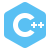

 
<h3 align="center">
  I'm a Web Developer and Software Engineering student, passionate about building tech that makes an impact.
</h3>
 

    

  <b>Connect With Me</b>

  
  &nbsp;&nbsp;&nbsp;
  
  &nbsp;&nbsp;&nbsp;
  

 

---

<h3 align="center">Main Technologies</h3>

<table align="center">
  <tr>
    <td align="center">
       MongoDB
    </td>
    <td align="center">
       Express
    </td>
    <td align="center">
       React
    </td>
    <td align="center">
       Node.js
    </td>
  </tr>
</table>

---

<h3 align="center">Programming Languages</h3>

<table align="center">
  <tr>
    <td align="center">
       JavaScript
    </td>
    <td align="center">
       Java
    </td>
    <td align="center">
       Python
    </td>
    <td align="center">
       C++
    </td>
    <td align="center">
       Prolog
    </td>
    <td align="center">
       PHP
    </td>
  </tr>
</table>

---

<h3 align="center">Graphic & Web Design Tools</h3>

<table align="center">
  <tr>
    <td align="center">
       CSS
    </td>
    <td align="center">
       Tailwind CSS
    </td>
    <td align="center">
       Qt
    </td>
    <td align="center">
       Figma
    </td>
    <td align="center">
       HTML
    </td>
  </tr>
</table>

---

<h3 align="center">Frameworks</h3>

<table align="center">
  <tr>
    <td align="center">
       React
    </td>
    <td align="center">
       Express
    </td>
    <td align="center">
       Django
    </td>
    <td align="center">
       Svelte
    </td>
    <td align="center">
       Nest
    </td>
  </tr>
</table>

---

<h3 align="center">Databases</h3>

<table align="center">
  <tr>
    <td align="center">
       MongoDB
    </td>
    <td align="center">
       SQL
    </td>
    <td align="center">
       MySQL
    </td>
    <td align="center">
       Oracle
    </td>
  </tr>
</table>

---

<h3 align="center">Contenerization</h3>

<table align="center">
  <tr>
    <td align="center">
       Docker
    </td>
  </tr>
</table>

---

<h3 align="center">Other Tools</h3>

<table align="center">
  <tr>
    <td align="center">
       Linux
    </td>
    <td align="center">
       Git
    </td>
    <td align="center">
       Jest
    </td>
    <td align="center">
       NPM
    </td>
    <td align="center">
       PyGame
    </td>
    <td align="center">
       Redux
    </td>
  </tr>
</table>
 

    

  

  <table>
    <tr>
      <td align="center">
        
      </td>
      <td align="center">
        
      </td>
    </tr>
  </table>

